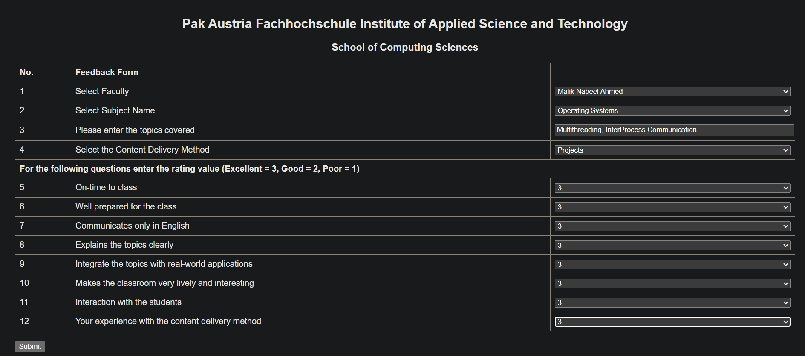
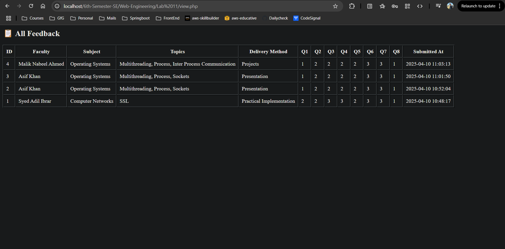

# Teacher Survey Feedback Form

## Overview
This web application provides a teacher survey feedback system for Pak Austria Fachhochschule Institute of Applied Science and Technology, School of Computing Sciences. It allows students to provide structured feedback on faculty members, course content, and teaching methods.

## Features
- Faculty selection from a dropdown menu
- Subject selection
- Topic entry
- Content delivery method selection
- Rating system for various teaching aspects (Excellent/Good/Poor)
- Form validation (client-side)
- Feedback storage in MySQL database
- View submitted feedback records

## Screenshots


*The main interface where users can submit their feedback*


*The view displaying all submitted feedback entries*


*How the feedback data is stored in the database*


## File Structure
- `index.html` - The main feedback form interface
- `assets/styles.css` - CSS styling for the form
- `assets/script.js` - Client-side form validation
- `process.php` - Handles form submission and database storage
- `view.php` - Displays all feedback records from the database

## Technologies Used
- HTML/CSS - Front-end structure and styling
- JavaScript - Client-side validation
- PHP - Server-side processing
- MySQL - Database storage
- PDO (PHP Data Objects) - Database connection and queries

## Setup Instructions
1. Clone or download this repository to your web server directory
2. Create a MySQL database named `feedback_db`
3. Create a table named `feedback` with the following structure:
   ```sql
   CREATE TABLE feedback (
     id INT AUTO_INCREMENT PRIMARY KEY,
     faculty VARCHAR(100) NOT NULL,
     subject VARCHAR(100) NOT NULL,
     topics TEXT NOT NULL,
     content_delivery_method VARCHAR(100) NOT NULL,
     q1 INT NOT NULL,
     q2 INT NOT NULL,
     q3 INT NOT NULL,
     q4 INT NOT NULL,
     q5 INT NOT NULL,
     q6 INT NOT NULL,
     q7 INT NOT NULL,
     q8 INT NOT NULL,
     submitted_at TIMESTAMP DEFAULT CURRENT_TIMESTAMP
   );
